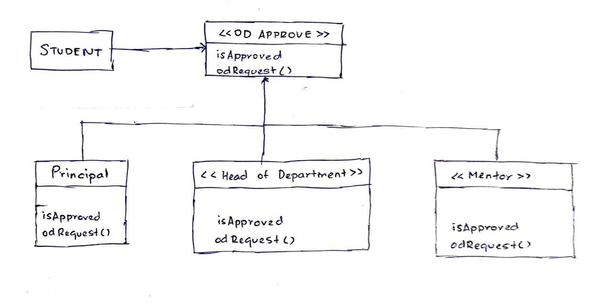
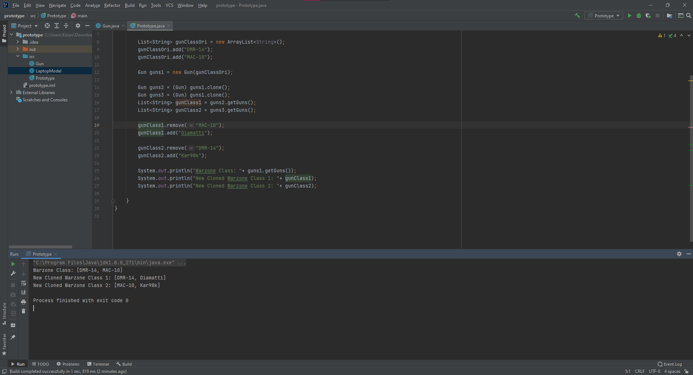

1. Class diagram and description of Chain of responsibilities design Pattern

In the chain of responsibility design pattern the objects present in the chain are responsible for the passing of requests along the chain. Thus, in a system of checks, a single failure is enough to stop the chain. 

In the following example, a student requires permission from all 3 Professors - Mentor, HOD and the Principal in order for his OD to be approved. Thus, even when one professor does not approve, the chain stops starting from the mentor at the low level. 

2. Example(Java Classes) for Prototype(Creational)

