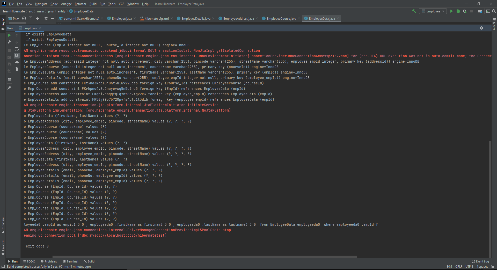
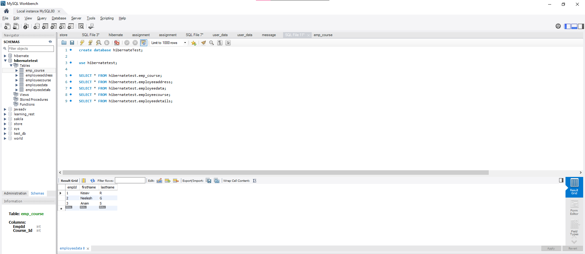
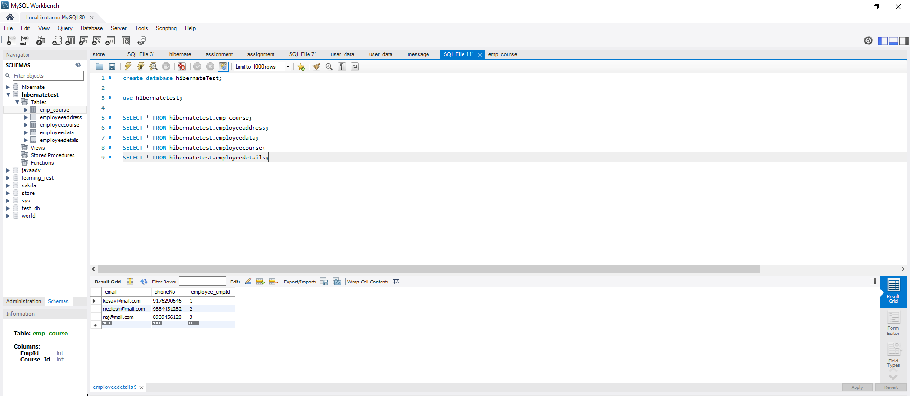
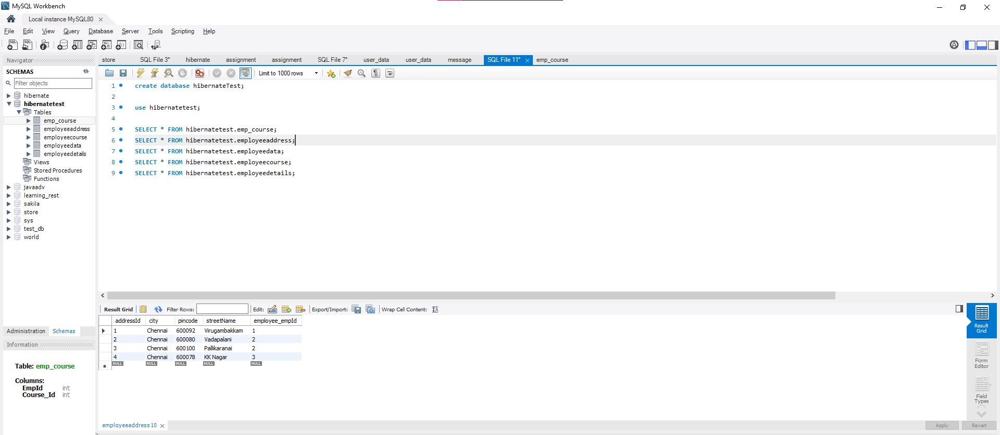
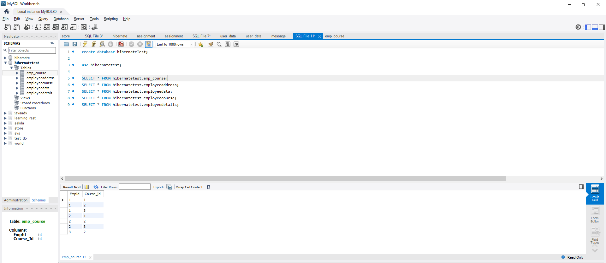

1. Add all data into database hibernatetest

2. Employee [id, firstName LastName]

3. OneToOneManpping with EmployeeDetails[phone and email]

4. OneToMany with Address [without Jointable] [Address has streetName,city,pincode]

5. ManyTomany[Courses] Only 1 Join Table. [Course has CourseName]

