A) Please do install following code analyzers in your IDE and document the installation process along with a screenshot of a report of code analysis for each plugin.

 1) Sonarlint (https://www.sonarlint.org/)

 Install

    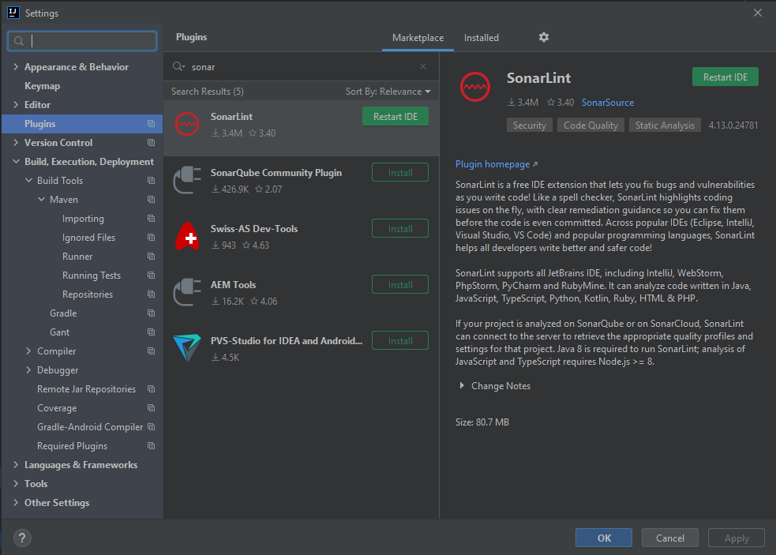

 Report

    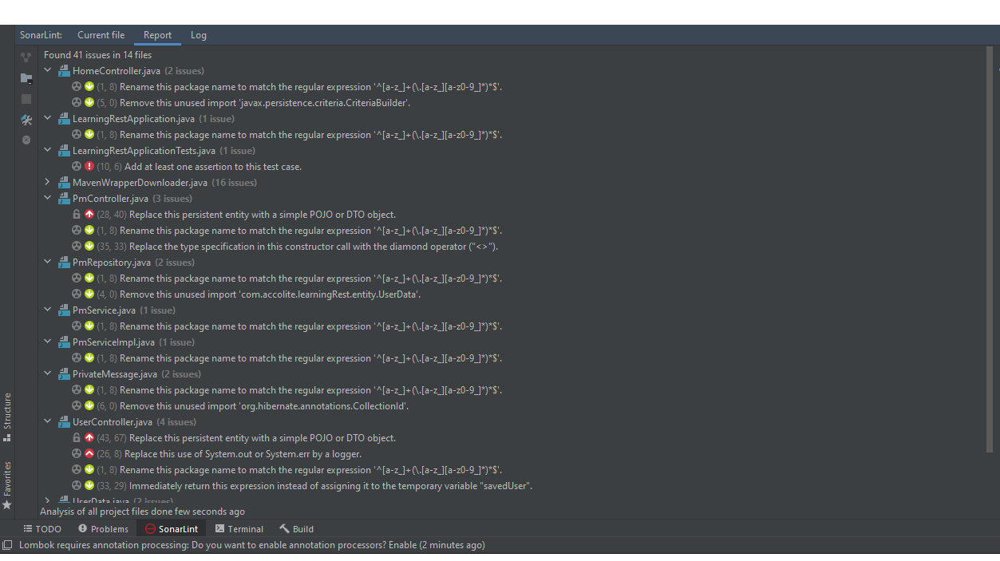

 2) PMD (we haven't discussed about it but it's a similar tool) (https://pmd.github.io/)

 Install

    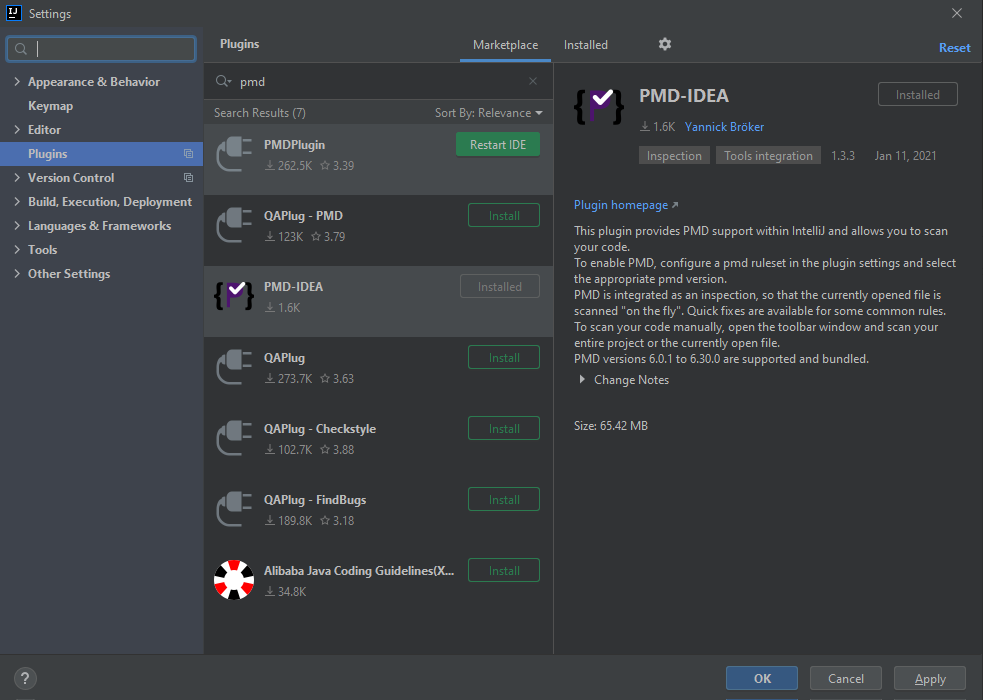

 Report

    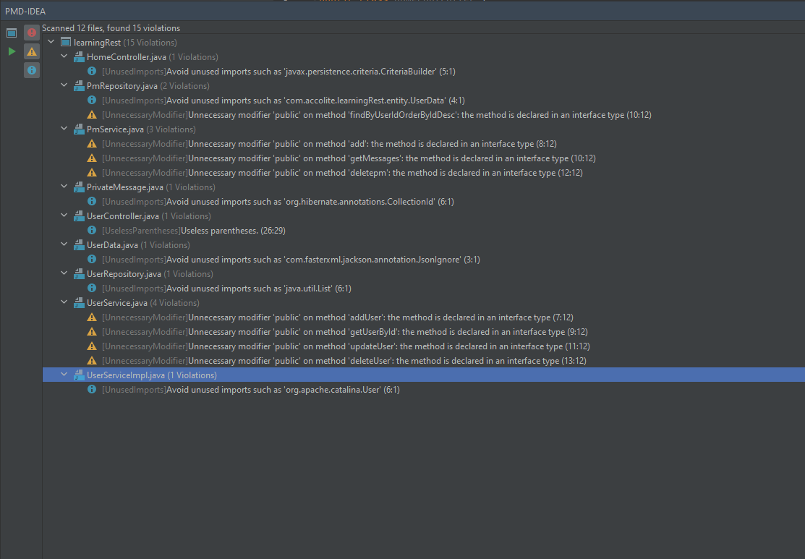

 3) Checkstyle (https://maven.apache.org/plugins/maven-checkstyle-plugin/usage.html)

 Install

    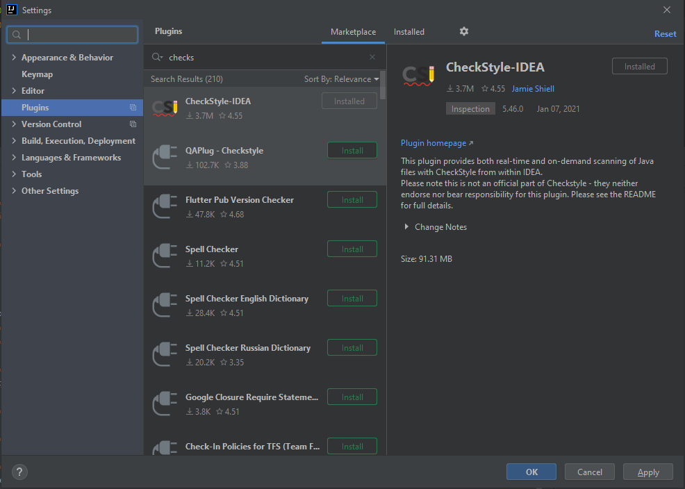

 Report

    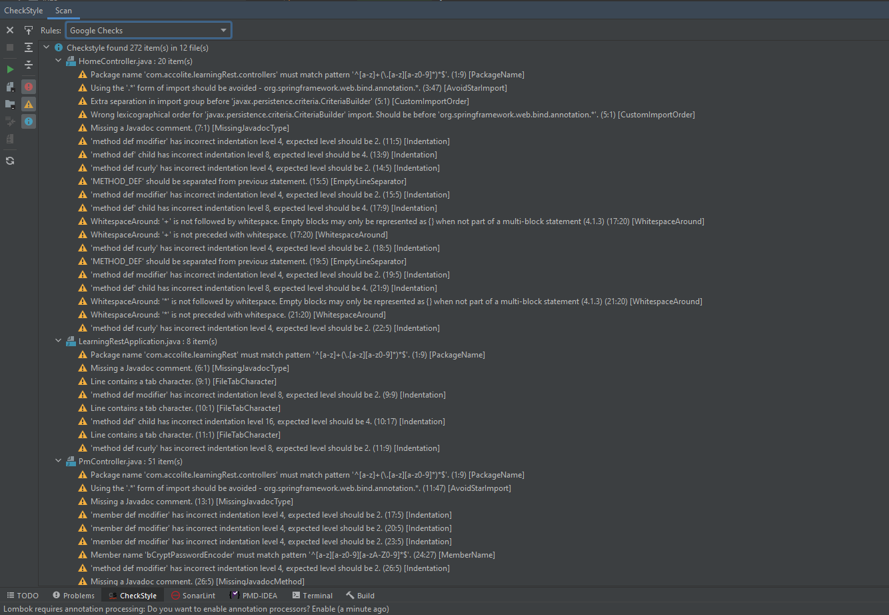

B) Install the sonarqube server in your local machine and run sonarqube analysis against one of your projects.
Choose any project of your choice which has at least 4 different classes.

Selected Project: REST WebServices

 1) Run Sonar Qube

    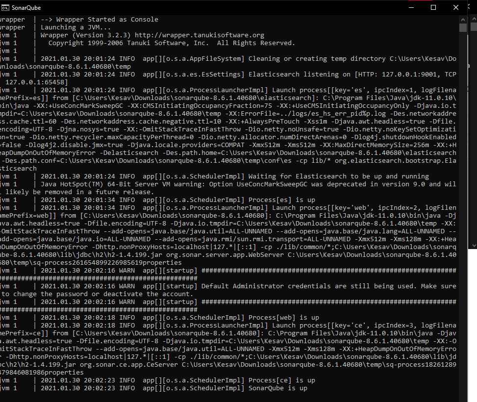

 2) Login

    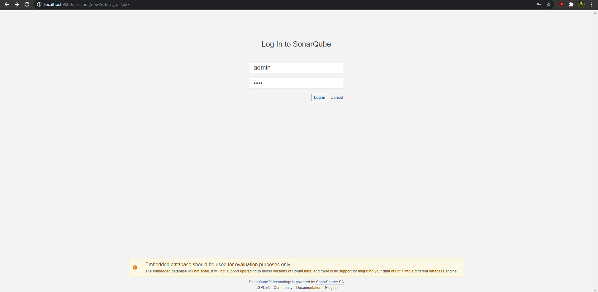

 3) New Project

    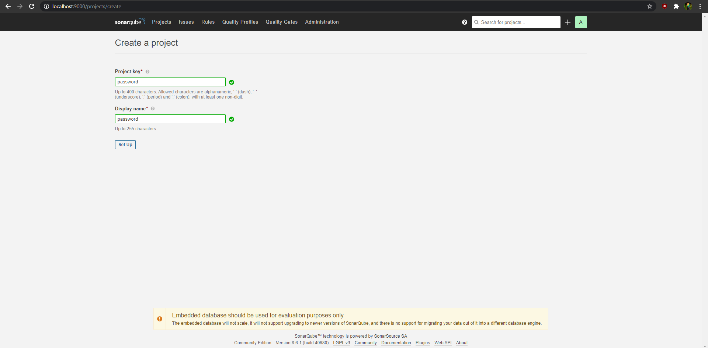

 4) Build in IntelliJ

    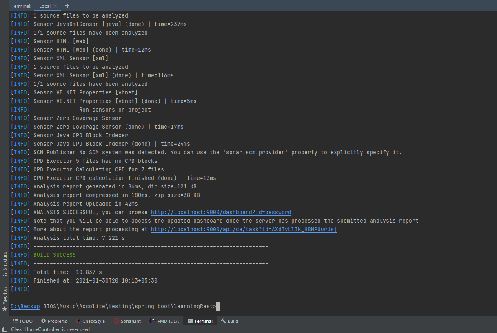
 
 5) Report

    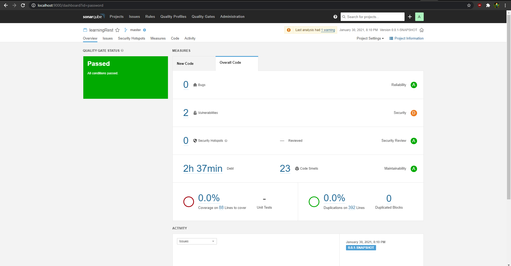

 6) Code Smells   

    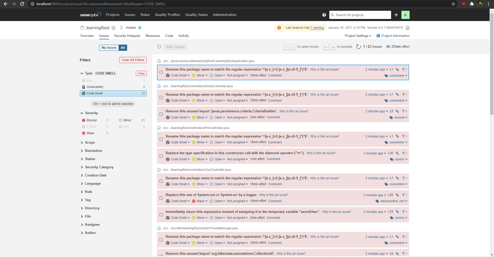

C) Document at least 5 points about following secure coding standards.

 1) Common Weakness Enumeration (CWE)

    Common Weakness Enumeration (CME) is a community-developed list of common software security weaknesses. This contains the most common and impactful issues experienced over the previous two calendar years. 

    Top CWE Issues:

        1. Improper Neutralization of Input During Web Page Generation ('Cross-site Scripting').

        2. Out-of-bounds Write.

        3. Improper Input Validation.

        4. Out-of-bounds Read.

        5. Improper Restriction of Operations within the Bounds of a Memory Buffer.

 2) Open Web Application Security Project (OWASP)

    The OWASP Top 10 is a standard awareness document for developers and web application security. It represents a broad consensus about the most critical security risks to web applications.

    Top Security Risks are:

        1. Injection
        2. Broken Authentication
        3. Sensitive Data Exposure
        4. XML External Entities (XXE)
        5. Broken Access Control

 3) CERT

    CERT is a secure coding standard maintained by the Software Engineering Institute at Carnegie Mellon University. It supports commonly used programming languages such as C, C++, and Java.

    CERT Risk Assessment

        1. Severity — How serious are the consequences of the rule being ignored.

        2. Likelihood — How likely is the coding flaw introduced by violating the rule can lead to an exploitable vulnerability?

        3. Remediation Cost — How expensive will it be to comply with the rule.

 4) SANS TOP 25

    The SANS Top 25 Most Dangerous Software Errors is a list of the most widespread and critical errors that can lead to serious vulnerabilities in software. The vulnerabilities include insecure interaction between components, risky resource management, and porous defenses.

    Top Ranked Errors

        1. Improper Neutralization of Special Elements used in an SQL Command ('SQL Injection')

        2. Improper Neutralization of Special Elements used in an OS Command ('OS Command Injection')

        3. Buffer Copy without Checking Size of Input ('Classic Buffer Overflow')

        4. Improper Neutralization of Input During Web Page Generation ('Cross-site Scripting')

        5. Missing Authentication for Critical Function

