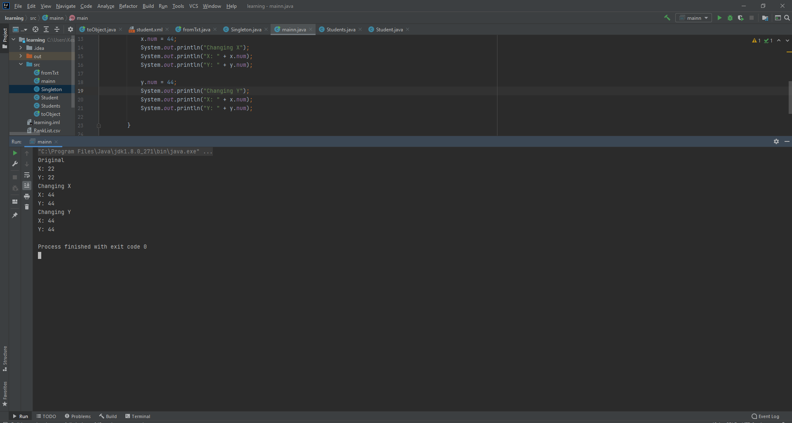

1. Read an XML file “”student.xml” containing list of student data in the following format, deserialize them into java objects, then serialize the unique <rollnumber, total marks(Phy+chem+math)> to a text file “student.txt” with appropriate exception handling.

2. Secondly, deserialize the previously stored student.txt file with roll num and total marks. Then, serialize the top 5 students' roll numbers and total marks into excel or csv file in the following format.

3. CSV File

4. Write the implementation for singleton class.

