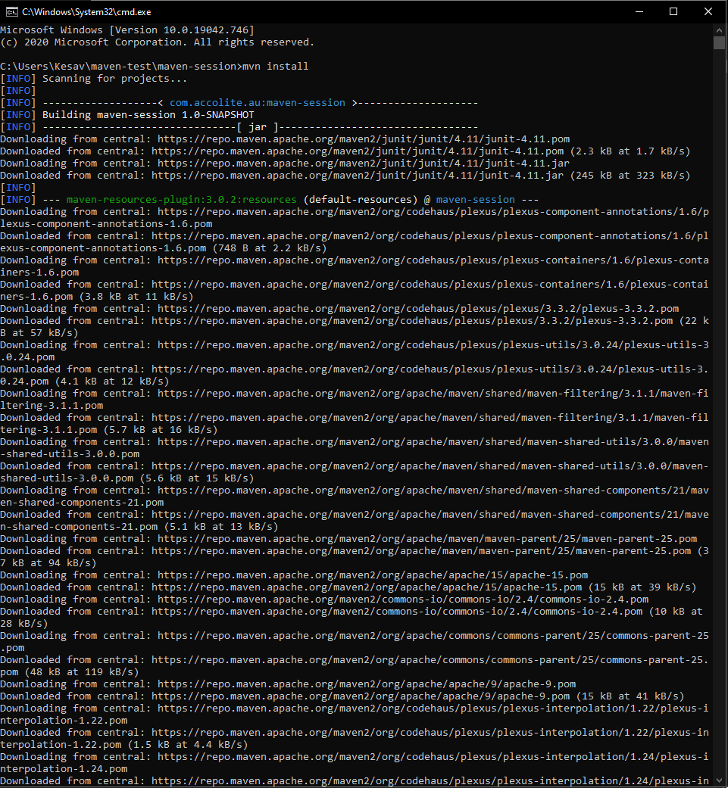
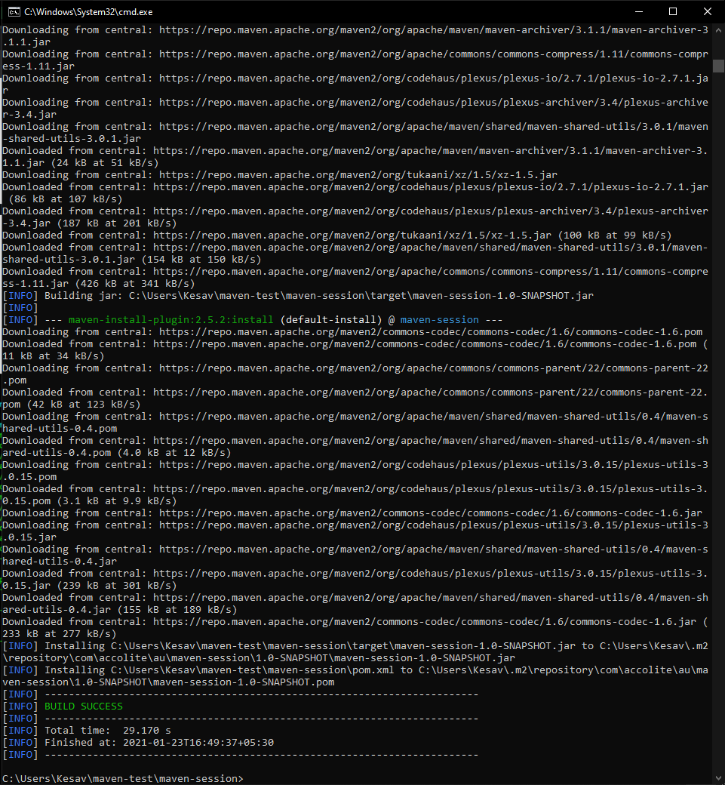
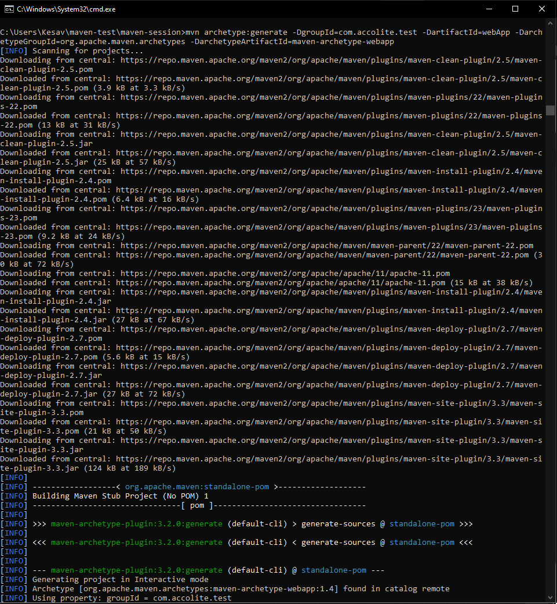
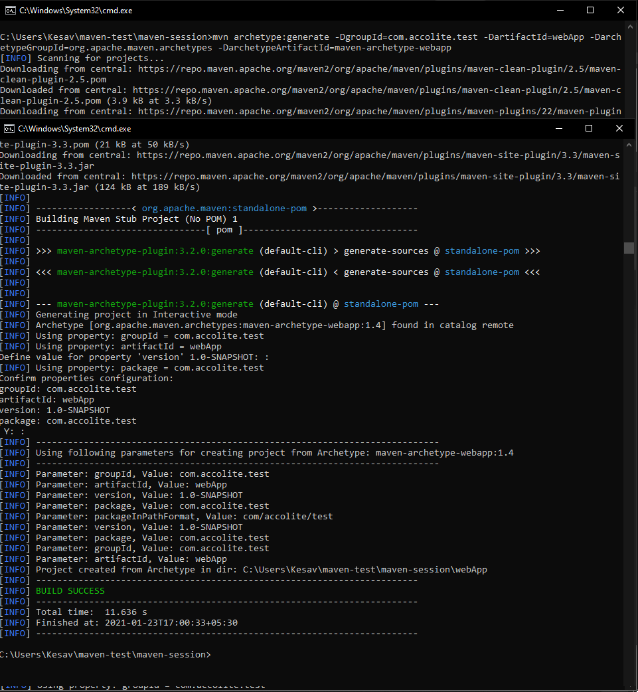
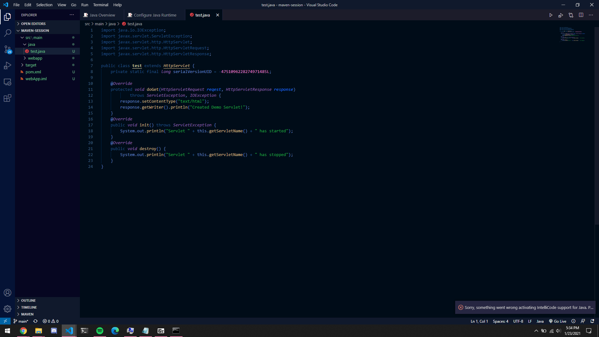
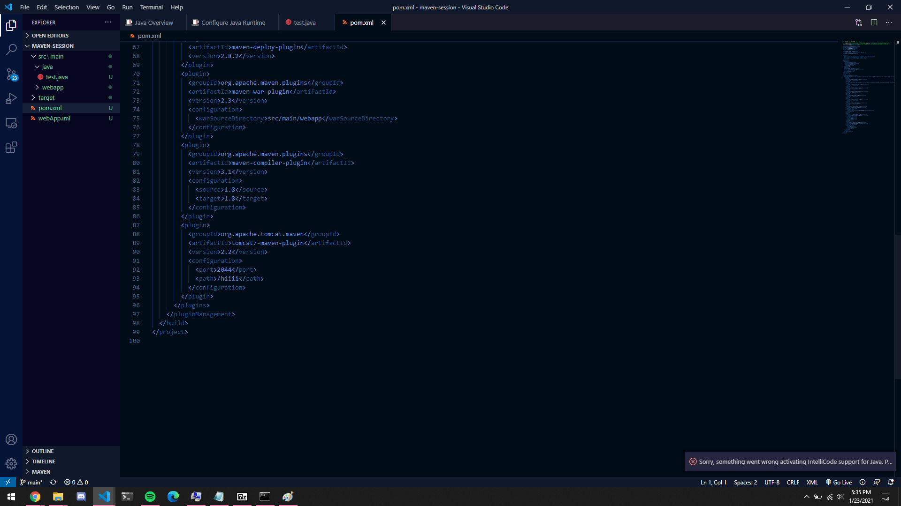
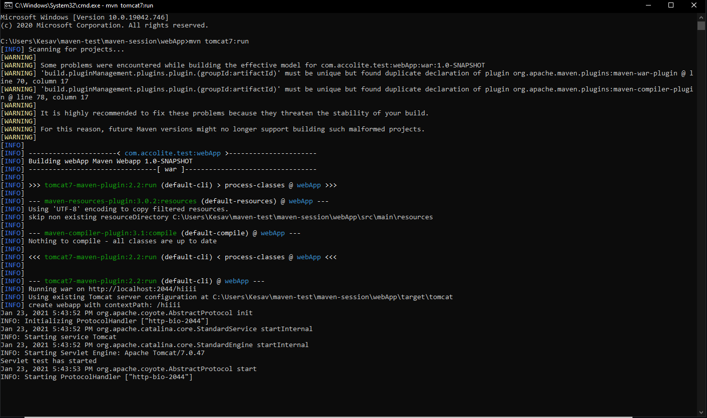
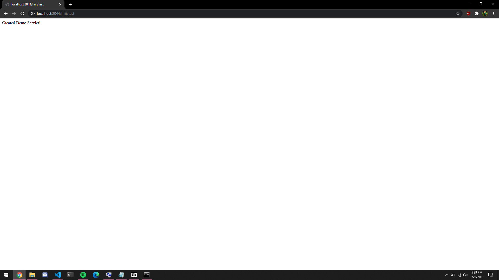

1. Perform "mvn install" on the "maven-session" project which was created during the session and share the screen-shots.

2. Create a web-app using the archetype plugin (https://maven.apache.org/guides/introduction/introduction-to-archetypes.html).

3. In the above created web-app add a sample servlet (https://javatutorial.net/java-servlet-example)

4. Use tomcat maven plugin and run the web-app (https://howtodoinjava.com/maven/tomcat-maven-plugin-example/)

