1. Add users to the Database using POST

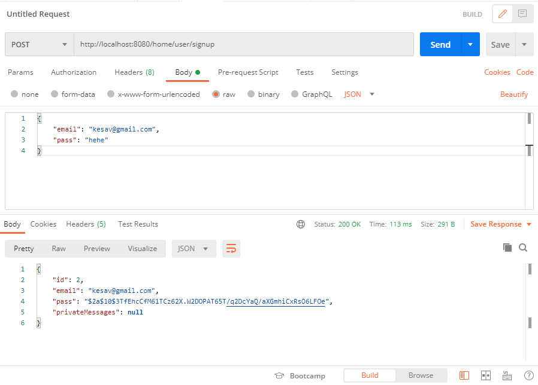

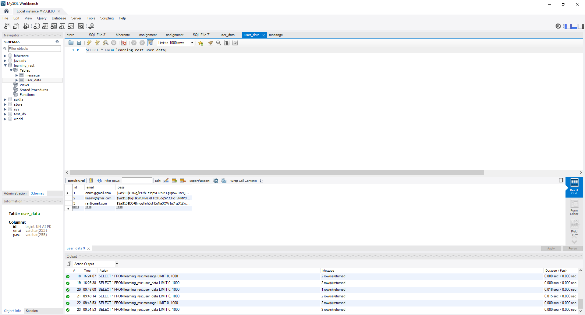

2. Add messages to the Database using POST

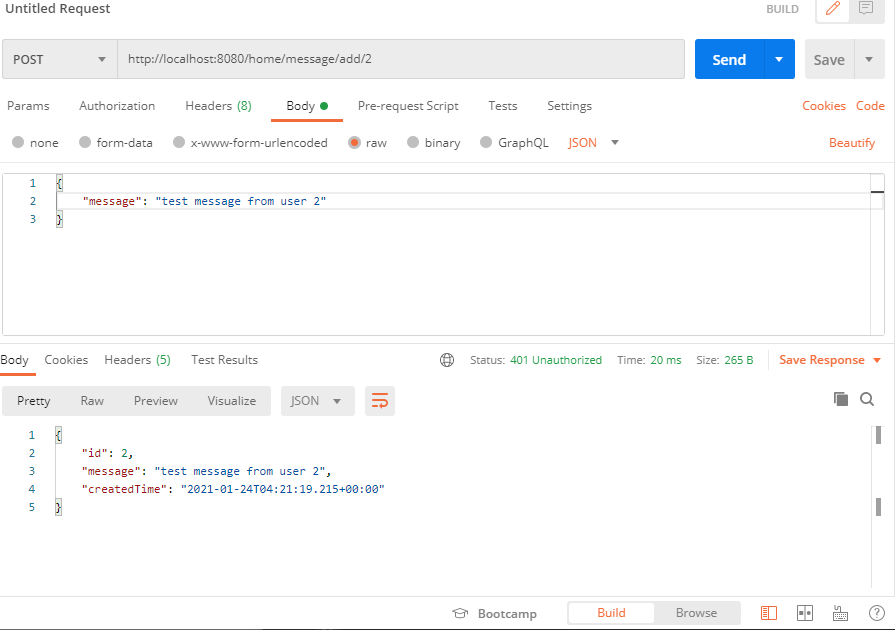

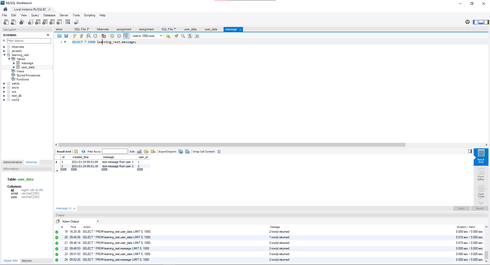

3. Get user data using GET

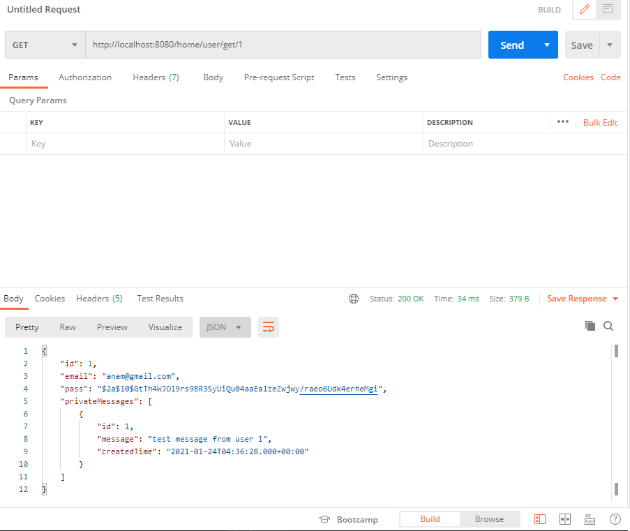

4. Get message data using GET

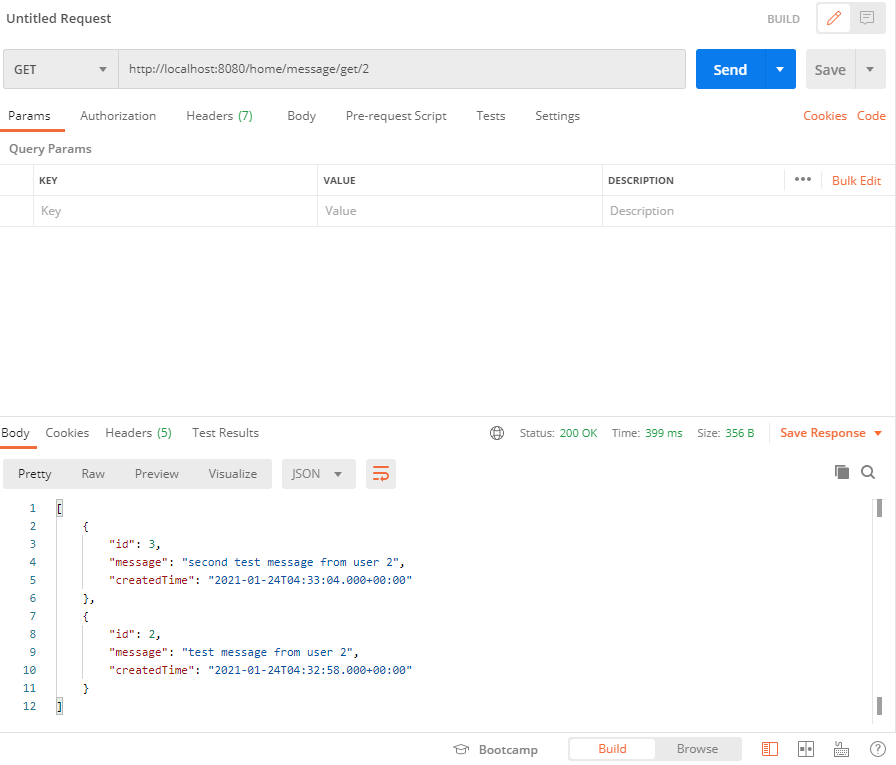

5. Update password of user using PUT

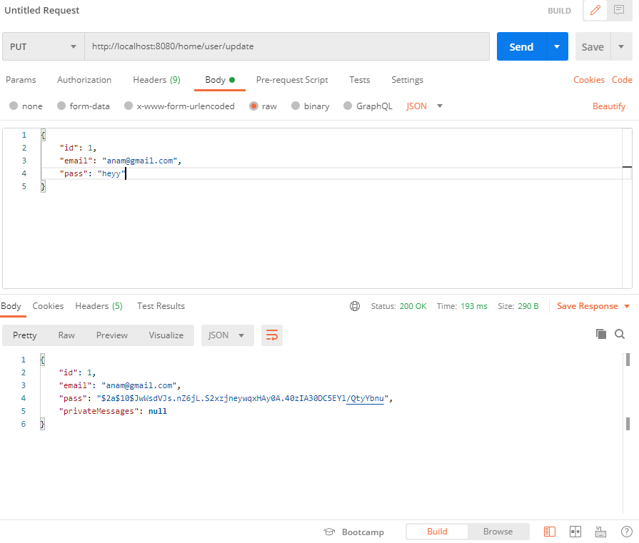

Before UPDATE

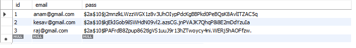

After UPDATE

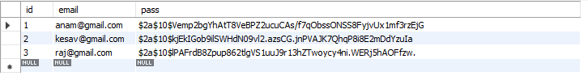

6. Delete message using DELETE

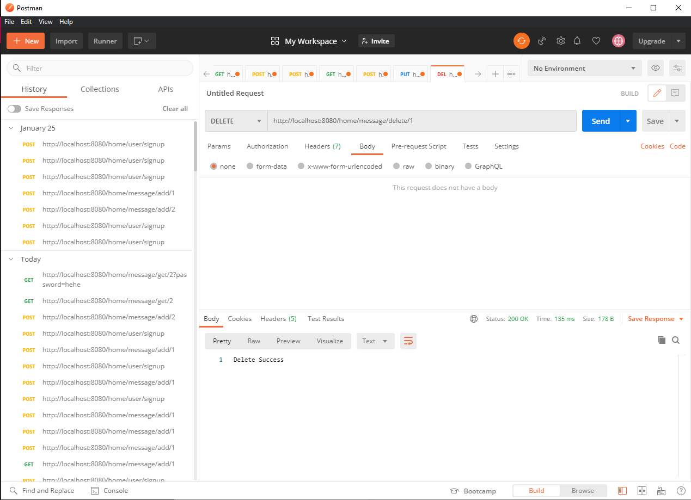

Before DELETE

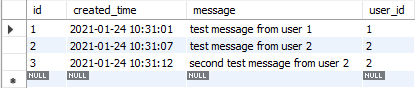

After DELETE

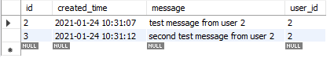

6. Delete user using DELETE

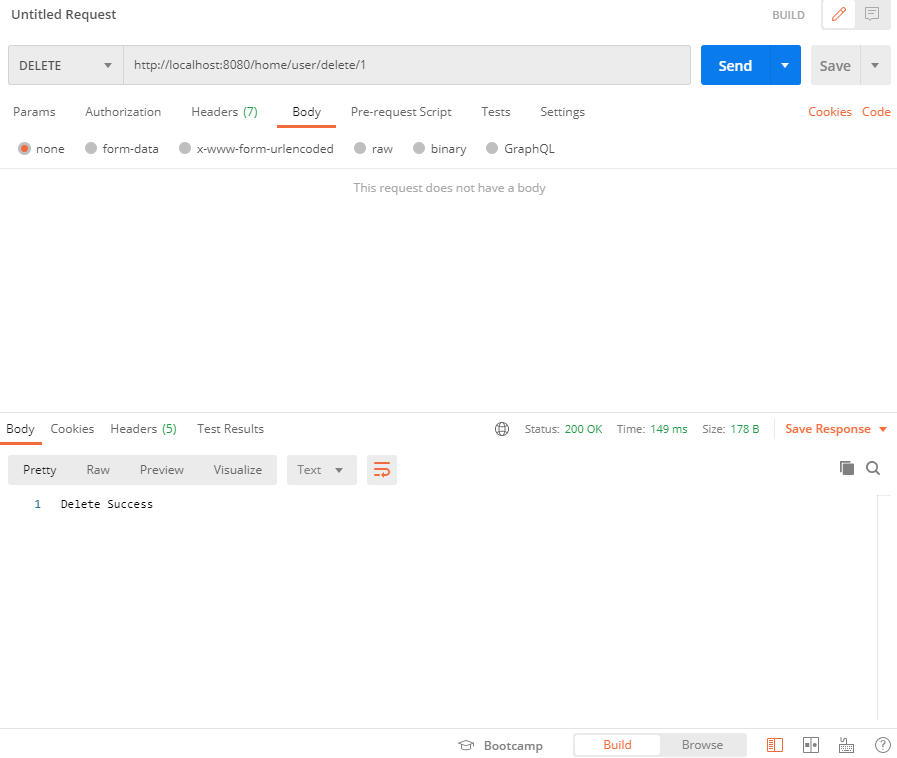

Before DELETE

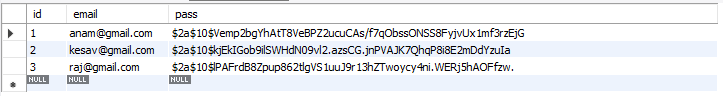

After DELETE

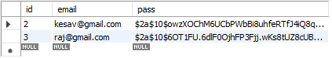
