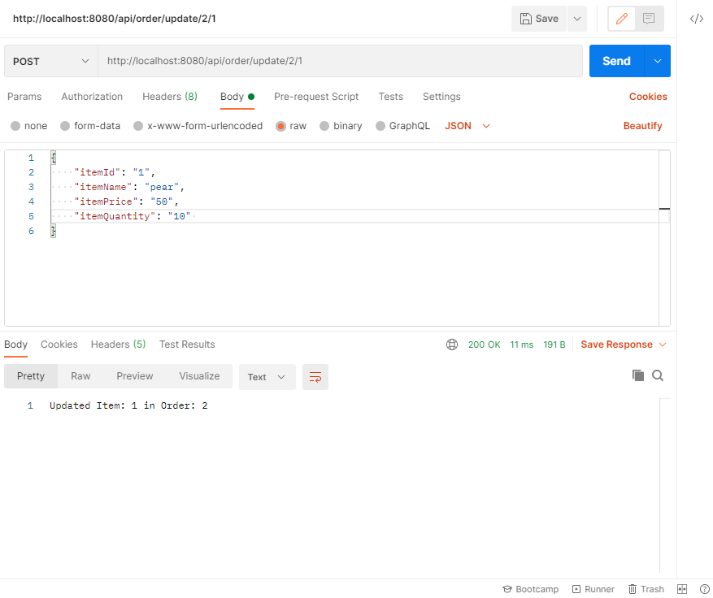

1. Create new Order with POST

2. Add item into Order with POST

2. Update item using POST

Before Update

After Update

3. Delete Item in Order

Before Delete

After Delete

4. Get Item using GET

